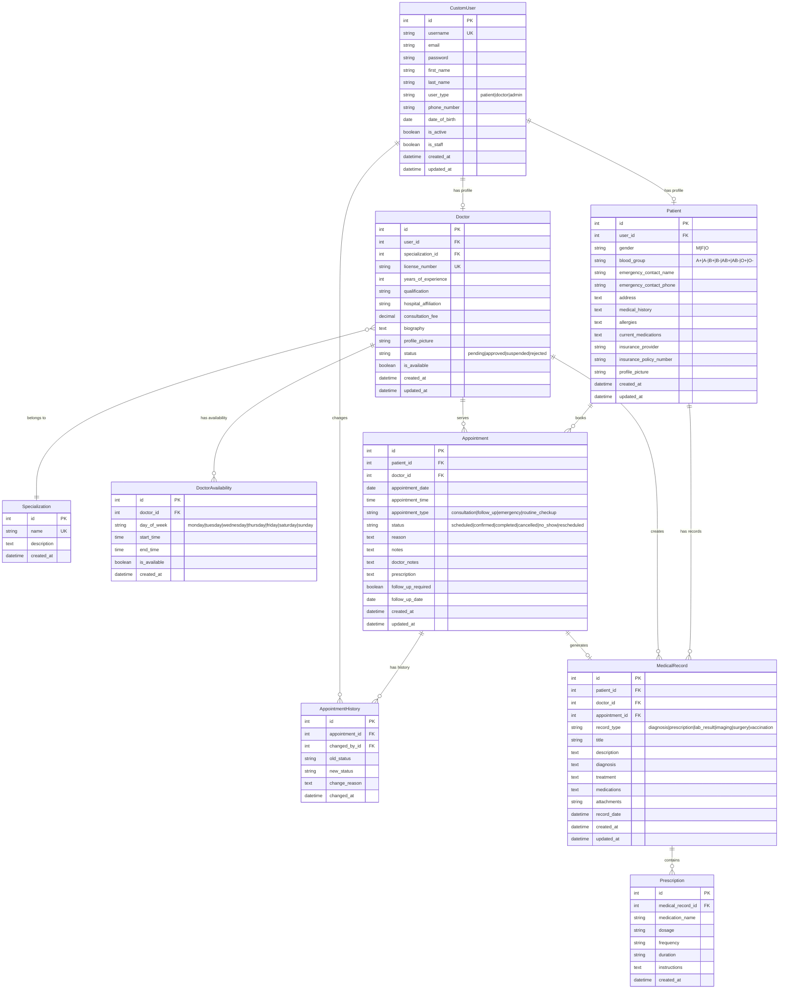

# Health Appointment Booking System
A comprehensive web-based healthcare management system built with Django that enables patients to book appointments with doctors, manage medical records, and streamline healthcare administration

## EDR

